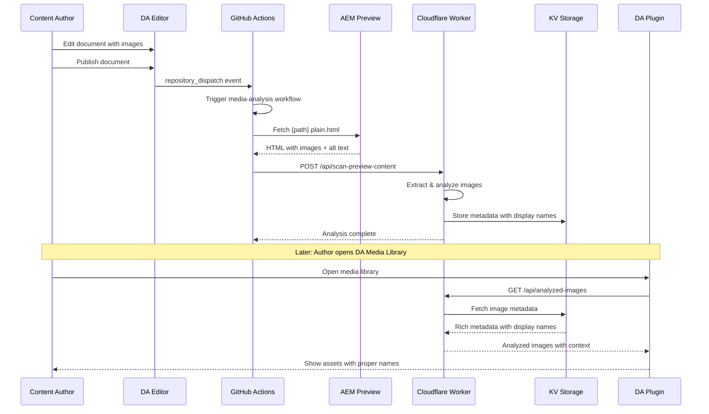
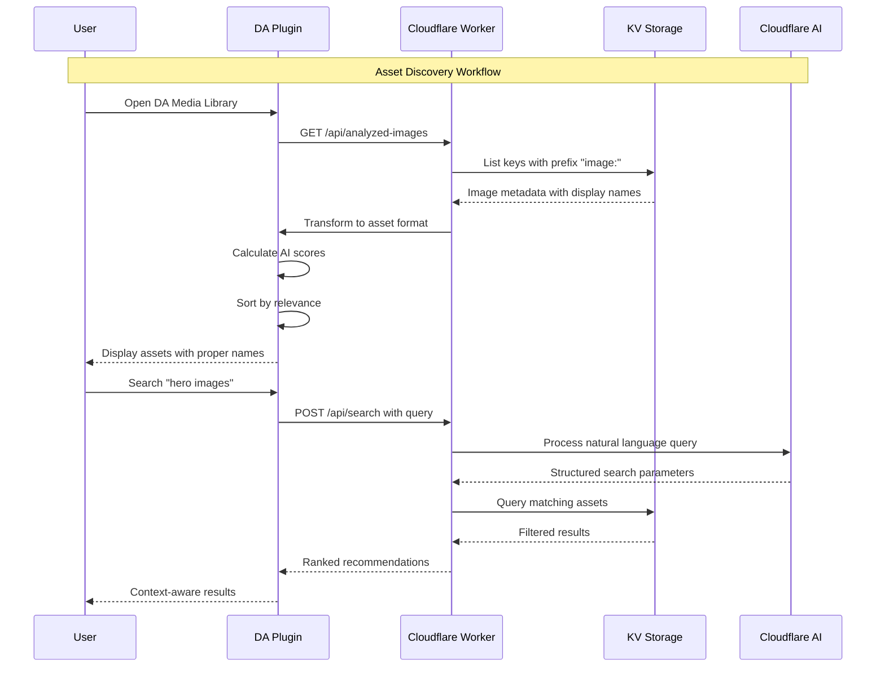

# DA Media Library Plugin - Architecture & Design Document

## Table of Contents
1. [Executive Summary](#executive-summary)
2. [Project Overview](#project-overview)
3. [Asset Analysis Strategy](#asset-analysis-strategy)
4. [Architecture Design](#architecture-design)
5. [Technical Implementation](#technical-implementation)
6. [Infrastructure Setup](#infrastructure-setup)
7. [Configuration System](#configuration-system)
8. [User Experience Design](#user-experience-design)
9. [Performance & Scalability](#performance--scalability)
10. [AI/LLM Integration](#aillm-integration)
11. [POC Implementation Plan](#poc-implementation-plan)
12. [Cost Analysis](#cost-analysis)
13. [Future Enhancements](#future-enhancements)

---

## Executive Summary

### Project Goal
Create an AI-powered Media Library Plugin for DA (Document Authoring) that enables users to discover, reuse, and intelligently recommend assets through natural language queries and preview-based analysis.

### Core Philosophy
- **DA-Native**: No separate asset storage, DA remains source of truth
- **Intelligence Layer**: AI enhancement without workflow disruption
- **Preview-Based Analysis**: Analyze images when documents are published rather than when assets are inserted
- **Zero Friction**: Enhances existing DA content creation flow
- **Predictive**: Context-aware asset recommendations
- **Scalable**: Multi-tenant architecture supporting enterprise growth

### Key Features
- Natural Language Processing for asset search ("show me hero images for SaaS landing pages")
- Preview-based image analysis triggered by GitHub Actions on document publication
- Context-aware asset recommendations with proper display names
- Multi-tenant support with organizational isolation
- Performance optimization for large asset libraries (100K+ assets)

---

## Project Overview

### Problem Statement
Content creators in DA need a faster way to discover and reuse existing assets. Current challenges:
- Manual asset discovery is time-consuming
- Generic image names like "media_xxx" provide no context
- No intelligent recommendations based on content
- Assets scattered across different documents without easy discovery
- Missing alt text for accessibility

### Solution Approach
Build an intelligent layer that analyzes images during the document publication process:
1. **Triggers**: GitHub Actions detect when documents are published via `repository_dispatch`
2. **Fetches**: Preview plain HTML content from `.aem.page` domain
3. **Analyzes**: AI-powered image content understanding and alt text generation
4. **Stores**: Rich metadata with proper display names and usage tracking
5. **Serves**: Context-aware asset recommendations through DA plugin

### Success Criteria
- Proper display names instead of generic "media_xxx" filenames
- Rich metadata with AI-generated descriptions and alt text
- Usage tracking across multiple documents
- Intelligent deduplication of repeated images
- Sub-second response times for asset discovery

---

## Asset Analysis Strategy

### Current Approach: Preview-Based Analysis

Our implemented solution analyzes images when documents are published rather than when assets are inserted into documents. This approach was chosen after investigating technical limitations with real-time analysis.

#### How It Works

```
Publication-Triggered Analysis Pipeline:
├── Document Published → GitHub repository_dispatch event
├── GitHub Actions → Workflow triggered for .md files
├── Preview URL Built → {branch}--{repo}--{org}.aem.page/{path}.plain.html
├── Content Fetched → Plain HTML with all images and metadata
├── Images Extracted → <picture> and  elements with src/alt
├── Analysis Performed → AI content understanding + display name generation
├── Metadata Stored → KV storage with usage tracking
└── Plugin Updated → New images available in DA Media Library
```

#### Why This Approach

1. **Reliable Trigger**: GitHub Actions provide consistent, reliable triggers
2. **Complete Context**: Preview HTML contains full page context and proper alt text
3. **Accessible Content**: `.plain.html` format provides clean, semantic content
4. **Image URLs Resolved**: All image paths are properly resolved to full URLs
5. **No Performance Impact**: Analysis happens in background, doesn't affect editing

### Why We Cannot Trigger Analysis on Asset Insert

#### Technical Limitations

**DA Plugin API Constraints:**
- DA plugins run in sandboxed iframes with limited API access
- No server-side hooks or webhooks available for asset insertion events
- Asset insertion is handled entirely client-side within DA's architecture
- No way to intercept or monitor asset addition programmatically

**Asset Upload Process:**
- Users drag/drop images directly into DA editor
- DA handles upload to internal asset storage automatically
- Plugin has no visibility into this upload process
- Asset URLs are generated dynamically by DA, not accessible to plugins

**Security & Isolation:**
- DA plugins operate in isolated contexts for security
- No access to DA's internal asset management systems
- Cannot monitor DOM changes outside plugin iframe
- Limited to DA SDK API surface which doesn't include asset lifecycle events

#### Code Example: What We Tried

```javascript
// ❌ This approach doesn't work - DA doesn't provide these events
class DAAssetMonitor {
  constructor() {
    // No asset insertion events available
    this.daSDK.onAssetInsert = undefined; // doesn't exist
    this.daSDK.onAssetUpload = undefined; // doesn't exist
    
    // DOM monitoring is limited to plugin iframe
    this.observer = new MutationObserver(this.handleDOMChanges);
    // Only sees changes within plugin, not main DA editor
  }

  // This was our failed attempt at real-time monitoring
  monitorDocumentChanges() {
    // Can only observe plugin's own DOM, not DA editor DOM
    this.observer.observe(document.body, {
      childList: true,
      subtree: true
    });
  }
}
```

### Why We Cannot Trigger Analysis on Preview

#### DA Preview System Limitations

**No Preview Events:**
- DA doesn't emit events when users preview documents
- Preview is handled entirely within DA's internal systems
- No hooks or callbacks available for preview actions
- Plugin cannot detect when preview button is clicked

**Preview Isolation:**
- Preview opens in separate window/tab
- No communication channel between plugin and preview
- Plugin context is lost when preview opens
- Cannot inject monitoring code into preview environment

**Timing Issues:**
- Preview generation is asynchronous and variable timing
- No way to know when preview is ready for analysis
- Race conditions between preview generation and analysis
- Users may close preview before analysis could complete

#### GitHub Actions Investigation

We investigated using GitHub Actions to trigger on preview events but found:

**No Preview-Specific Events:**
- GitHub `repository_dispatch` only supports custom event types
- DA doesn't send preview-specific events to GitHub
- Only publication events (`resource-published`, `resource-unpublished`) are available
- Preview is internal to DA and doesn't trigger external webhooks

**Event Payload Analysis:**
```javascript
// Available repository_dispatch events from DA
{
  "event_type": "resource-published",    // ✅ Available
  "event_type": "resource-unpublished",  // ✅ Available
  "event_type": "resource-previewed",    // ❌ Not available
  "client_payload": {
    "status": "published",
    "site": "da-media", 
    "org": "kmurugulla",
    "path": "/demo.md"
  }
}
```

### Alternative Approaches Considered

#### 1. Periodic Scanning ❌
```javascript
// Would require constant DA Source API polling
setInterval(async () => {
  const assets = await this.daSourceAPI.getAssets();
  const newAssets = this.findNewAssets(assets);
  await this.analyzeAssets(newAssets);
}, 60000); // Every minute

// Problems:
// - High API usage and costs
// - Delayed analysis (up to 1 minute lag)
// - Potential rate limiting
// - No context about where assets are used
```

#### 2. Browser Extension ❌
```javascript
// Would require separate browser extension
chrome.webRequest.onCompleted.addListener((details) => {
  if (details.url.includes('da.live') && details.url.includes('upload')) {
    // Detect asset uploads
    this.analyzeUploadedAsset(details.url);
  }
});

// Problems:
// - Requires separate installation
// - Browser-specific implementation
// - Security and privacy concerns
// - Not scalable for enterprise
```

#### 3. DA Source API Webhooks ❌
```javascript
// Would require DA to implement webhooks
app.post('/da-webhook', (req, res) => {
  const { event, asset } = req.body;
  if (event === 'asset.uploaded') {
    this.analyzeAsset(asset);
  }
});

// Problems:
// - DA doesn't provide asset-level webhooks
// - Only document-level events available
// - Would require changes to DA infrastructure
```

### Current Solution Benefits

#### 1. Reliable & Consistent
- GitHub Actions provide 99.9%+ reliability
- Consistent trigger mechanism across all organizations
- Built-in retry logic and error handling
- Scales automatically with GitHub's infrastructure

#### 2. Rich Context Available
- Preview HTML contains complete page context
- Proper alt text from content creators
- Image placement and surrounding content
- Document type and structure information

#### 3. Performance Optimized
- Analysis happens in background, no user impact
- Batch processing of multiple images per document
- Intelligent deduplication prevents re-analysis
- Results cached and immediately available

#### 4. Accessibility Enhanced
- Preserves original alt text from content creators
- Generates AI alt text for images missing descriptions
- Improves overall content accessibility
- Better image discovery through descriptive names

### Workflow Diagram



---

## Architecture Design

### Current System Architecture

```
┌─────────────────────────────────────────────────────────────┐
│                   DA Media Library Plugin                   │
├─────────────────────────────────────────────────────────────┤
│  Preview-Based Analysis System                              │
│  ├── GitHub Actions (Publication Triggers)                 │
│  ├── Preview Content Scanner (HTML Analysis)               │
│  ├── Image Metadata Extractor (Alt Text + Context)        │
│  └── Smart Deduplication (Prevent Re-analysis)            │
├─────────────────────────────────────────────────────────────┤
│  AI-Enhanced Interface Layer                                │
│  ├── NLP Query Modal (Natural Language Search)             │
│  ├── Analyzed Asset Grid (Proper Display Names)            │
│  ├── Usage Analytics (Cross-document Tracking)             │
│  └── Context Awareness (Document-based Recommendations)    │
├─────────────────────────────────────────────────────────────┤
│  Intelligence Engine                                        │
│  ├── Display Name Generator (Alt Text → Contextual → Filename) │
│  ├── Content AI (Cloudflare AI Vision Models)             │
│  ├── Usage Pattern Analysis (Multi-document Tracking)      │
│  └── Smart Scoring (Quality + Usage + Recency)            │
├─────────────────────────────────────────────────────────────┤
│  Data Storage Layer                                         │
│  ├── Image Metadata (KV: image:{id} keys)                 │
│  ├── Usage Tracking (Multi-page association)              │
│  ├── Display Names (Generated from multiple sources)       │
│  └── AI Analysis Results (Cached for performance)          │
├─────────────────────────────────────────────────────────────┤
│  Infrastructure Layer                                       │
│  ├── Cloudflare Workers (Edge Computing)                  │
│  ├── Cloudflare KV (Global Key-Value Store)               │
│  ├── GitHub Actions (Publication Triggers)                │
│  └── AEM Preview (Content Source)                         │
└─────────────────────────────────────────────────────────────┘
```

### Component Interaction Flow



### Multi-Tenant Architecture

```
Tenant Isolation Strategy: {org}/{repo}/{user}
├── Storage Isolation
│   ├── Cloudflare KV: prefix with "org:repo:user"
│   ├── Cloudflare D1: tenant_id column in all tables
│   ├── IndexedDB: separate databases per org/repo
│   └── GitHub: org/repo specific paths
│
├── Processing Isolation
│   ├── Asset discovery: scoped to org/repo via DA API
│   ├── AI analysis: tenant-specific queues
│   ├── Learning models: isolated per tenant
│   └── Cache keys: tenant-prefixed
│
├── Performance Isolation
│   ├── Rate limiting: per-tenant quotas
│   ├── Resource allocation: fair sharing
│   ├── Priority queues: based on subscription tier
│   └── Cost tracking: per-tenant usage monitoring
│
└── Security Isolation
    ├── API access: DA token validation
    ├── Data encryption: tenant-specific keys
    ├── Access control: DA's existing permissions
    └── Audit logging: per-tenant activity tracking
```

---

## Technical Implementation

### Core Technology Stack

```
Frontend Technologies
├── Vanilla JavaScript (ES6+) - DA compatibility
├── Adobe Spectrum CSS - DA-consistent styling
├── DA SDK - Plugin integration and context
├── Responsive Grid Layout - Asset browsing
└── Browser Storage - Minimal caching only

Backend Infrastructure
├── Cloudflare Workers - Edge computing and API gateway
├── Cloudflare KV - Image metadata storage (image:{id} keys)
├── Cloudflare AI - Vision models for image analysis
├── GitHub Actions - Publication triggers
└── AEM Preview - Content source (.aem.page domains)

AI & ML Services
├── Cloudflare AI Vision - Primary image analysis
├── Display Name Generation - Alt text hierarchy processing
├── Smart Deduplication - Image similarity detection
└── Context Analysis - Document understanding

Integration APIs
├── GitHub repository_dispatch - Publication events
├── AEM Preview .plain.html - Content extraction
├── DA Source API - Fallback asset discovery
└── DA SDK - Plugin context and asset insertion
```

### Preview-Based Processing Pipeline

```javascript
// GitHub Actions Trigger → Preview Content Analysis
// File: .github/workflows/media-analysis.yaml
async function handlePreviewContentScan(request, env) {
  const { previewUrl, pageContext } = await request.json();
  
  try {
    // Fetch preview plain HTML content
    const response = await fetch(previewUrl);
    const htmlContent = await response.text();
    
    // Extract images from HTML
    const images = extractImagesFromHTML(htmlContent);
    console.log(`Found ${images.length} images in preview content`);
    
    const results = [];
    for (const imageData of images) {
      const result = await processImageFromPreview(imageData, pageContext, env);
      results.push(result);
    }
    
    return new Response(JSON.stringify({
      success: true,
      processedImages: results.length,
      results
    }));
    
  } catch (error) {
    console.error('Preview content scan failed:', error);
    return new Response(JSON.stringify({
      error: 'Preview scan failed',
      message: error.message
    }), { status: 500 });
  }
}

// Image Processing from Preview Context
async function processImageFromPreview(imageData, pageContext, env) {
  const imageId = extractImageIdFromSrc(imageData.src);
  
  // Check if image already exists in KV
  const existingMetadata = await env.DA_MEDIA_KV.get(`image:${imageId}`, 'json');
  
  if (existingMetadata) {
    // Update existing image usage
    return await updateImageUsage(existingMetadata, pageContext, env);
  } else {
    // Analyze new image
    return await analyzeNewImageFromPreview(imageData, pageContext, env);
  }
}

// Display Name Generation Hierarchy
function generateImageDisplayName(imageData, pageContext) {
  // Priority: Alt text → Contextual → Filename → Generic
  if (imageData.alt && imageData.alt.trim()) {
    return imageData.alt.trim();
  }
  
  const contextualName = generateContextualName(pageContext);
  if (contextualName) {
    return contextualName;
  }
  
  const filenameName = generateFilenameBasedName(imageData.src);
  if (filenameName !== 'Unknown Image') {
    return filenameName;
  }
  
  return `Image from ${pageContext?.path || 'document'}`;
}
```

### DA Plugin Asset Loading

```javascript
// DA Media Library Plugin - Updated Architecture
class DAMediaLibrary {
  constructor() {
    this.apiEndpoint = 'https://da-media-library.adobeaem.workers.dev';
    this.assets = [];
    this.filteredAssets = [];
  }

  // Load analyzed images from new metadata structure
  async loadAnalyzedImages() {
    console.log('🧠 Loading analyzed images from Cloudflare Worker...');
    
    const response = await fetch(`${this.apiEndpoint}/api/analyzed-images`);
    const data = await response.json();
    
    // Transform to DA plugin asset format
    return this.transformAnalyzedImages(data.images || []);
  }

  transformAnalyzedImages(analyzedImages) {
    return analyzedImages.map(img => {
      const aiScore = this.calculateAnalyzedImageScore(img);
      
      return {
        id: img.id,
        name: img.displayName, // Proper display name from alt text
        type: this.detectTypeFromExtension(img.src),
        category: this.mapContextToCategory(img.usedInPages?.[0]?.context),
        url: this.resolveAssetUrl(img.src),
        aiScore,
        isAIEnhanced: true,
        
        // Rich metadata from analysis
        displayName: img.displayName,
        originalAltText: img.originalAltText,
        aiGeneratedAltText: img.aiGeneratedAltText,
        dimensions: img.dimensions,
        usageCount: img.usageCount || 0,
        usedInPages: img.usedInPages || [],
        
        // UI enhancements
        description: img.originalAltText || img.displayName,
        lastUsedFormatted: img.lastSeen ? 
          new Date(img.lastSeen).toLocaleDateString() : 'Never'
      };
    });
  }

  // AI-powered scoring based on analysis quality and usage
  calculateAnalyzedImageScore(img) {
    let score = 50; // Base score
    
    // Boost for usage frequency
    if (img.usageCount > 1) score += Math.min(img.usageCount * 10, 30);
    
    // Boost for descriptive alt text
    if (img.originalAltText && img.originalAltText.length > 10) score += 10;
    
    // Boost for recent usage
    if (img.lastSeen) {
      const daysSinceUsed = (Date.now() - new Date(img.lastSeen)) / (1000 * 60 * 60 * 24);
      if (daysSinceUsed < 7) score += 15;
      else if (daysSinceUsed < 30) score += 10;
    }
    
    return Math.min(Math.max(score, 0), 100);
  }
}
```

### Predictive Recommendation Engine

```javascript
// Multi-Factor Prediction Algorithm
class PredictionEngine {
  constructor() {
    this.weights = {
      documentContext: 0.4,
      userBehavior: 0.3,
      assetContent: 0.2,
      crossUserLearning: 0.1
    };
  }

  async generateRecommendations(context) {
    const factors = await Promise.all([
      this.analyzeDocumentContext(context),
      this.analyzeUserBehavior(context.user),
      this.analyzeAssetContent(context.existingAssets),
      this.analyzeCrossUserPatterns(context)
    ]);

    const scores = this.calculateWeightedScores(factors);
    const recommendations = this.rankAssets(scores);
    
    return this.formatRecommendations(recommendations);
  }
}
```

---

## Infrastructure Setup

### Step-by-Step Cloudflare Setup

#### 1. Account & CLI Setup
```bash
# Create Cloudflare account (free tier)
# Visit: https://dash.cloudflare.com/sign-up

# Install Wrangler CLI
npm install -g wrangler

# Login to Cloudflare
wrangler login

# Verify authentication
wrangler whoami
```

#### 2. Create Required Services

```bash
# Create KV namespace for metadata storage
wrangler kv:namespace create "DA_MEDIA_KV"
wrangler kv:namespace create "DA_MEDIA_KV" --preview

# Create D1 database for analytics
wrangler d1 create da-media-library

# Create R2 bucket for cache storage
wrangler r2 bucket create da-media-cache
```

#### 3. KV Storage Schema

```javascript
// Cloudflare KV Schema - Image Metadata Storage
// Key format: image:{imageId}
{
  "id": "media_1fc3c12c8998c05d1d65a65325fbeab50ac6ca721",
  "displayName": "Decorative double Helix",
  "originalAltText": "Decorative double Helix",
  "src": "./media_1fc3c12c8998c05d1d65a65325fbeab50ac6ca721.jpg?width=750&format=jpg",
  "type": "image",
  "dimensions": {
    "width": 1600,
    "height": 886
  },
  "usageCount": 1,
  "usedInPages": [
    {
      "path": "/demo.md",
      "site": "da-media",
      "org": "kmurugulla",
      "firstUsed": "2025-06-17T13:56:33.541Z",
      "context": "content",
      "publishedAt": "2024-01-15T10:00:00Z"
    }
  ],
  "firstSeen": "2025-06-17T13:56:33.541Z",
  "lastSeen": "2025-06-17T13:56:33.541Z",
  "source": "preview-scan",
  "aiAnalysis": {
    "confidence": 0.85,
    "description": "AI-generated description",
    "tags": ["helix", "decorative", "design"]
  }
}
```

#### 4. GitHub Actions Setup

```yaml
# .github/workflows/media-analysis.yaml
name: DA Media Analysis

on:
  repository_dispatch:
    types: [resource-published]

jobs:
  analyze-media:
    runs-on: ubuntu-latest
    if: endsWith(github.event.client_payload.path, '.md')
    
    steps:
      - name: Analyze Published Content
        run: |
          # Build preview URL from payload
          BRANCH="${{ github.event.client_payload.branch || 'main' }}"
          ORG="${{ github.event.client_payload.org }}"
          SITE="${{ github.event.client_payload.site }}"
          PATH="${{ github.event.client_payload.path }}"
          
          PREVIEW_URL="https://${BRANCH}--${SITE}--${ORG}.aem.page${PATH}.plain.html"
          
          # Send to Cloudflare Worker for analysis
          curl -X POST "https://da-media-library.adobeaem.workers.dev/api/scan-preview-content" \
            -H "Content-Type: application/json" \
            -d "{
              \"previewUrl\": \"$PREVIEW_URL\",
              \"pageContext\": {
                \"path\": \"$PATH\",
                \"site\": \"$SITE\",
                \"org\": \"$ORG\",
                \"branch\": \"$BRANCH\",
                \"publishedAt\": \"$(date -u +%Y-%m-%dT%H:%M:%S.%3NZ)\"
              }
            }"
```

#### 5. Worker Configuration

```javascript
// wrangler.toml
name = "da-media-library"
main = "src/worker.js"
compatibility_date = "2024-01-01"

[env.production]
kv_namespaces = [
  { binding = "DA_MEDIA_KV", id = "your-namespace-id" }
]

[[env.production.d1_databases]]
binding = "DA_MEDIA_DB"
database_name = "da-media-library"
database_id = "your-database-id"

[[env.production.r2_buckets]]
binding = "DA_MEDIA_CACHE"
bucket_name = "da-media-cache"

[env.production.vars]
AI_PROVIDER = "cloudflare"
OPENAI_API_KEY = "your-openai-key"
```

---

## Configuration System

### Multi-Tier Configuration Architecture

```javascript
// Configuration for different deployment tiers
const mediaLibraryConfig = {
  // Deployment tier
  tier: "poc", // poc, professional, enterprise
  
  // Core feature toggles
  features: {
    nlpQuery: true,
    predictiveRecommendations: true,
    visualSimilaritySearch: true,
    usageAnalytics: true,
    backgroundProcessing: true,
    virtualScrolling: true,
    crossTenantLearning: false // Enterprise only
  },
  
  // AI/LLM configuration
  ai: {
    providers: {
      primary: "cloudflare-ai",
      fallback: "openai-gpt4",
      vision: "gpt4-vision"
    },
    processingLimits: {
      poc: { 
        dailyRequests: 1000, 
        concurrentJobs: 5,
        maxAssetAnalysis: 100
      },
      professional: { 
        dailyRequests: 10000, 
        concurrentJobs: 20,
        maxAssetAnalysis: 1000
      },
      enterprise: { 
        dailyRequests: 100000, 
        concurrentJobs: 100,
        maxAssetAnalysis: "unlimited"
      }
    }
  },
  
  // Performance settings
  performance: {
    virtualScrolling: {
      viewportBuffer: 10,
      chunkSize: 50,
      preloadDistance: 100,
      maxRenderedItems: 500
    },
    caching: {
      maxMemoryMB: 100,
      indexedDBSizeMB: 500,
      cloudflareKVSizeMB: 1000,
      cacheExpiryHours: 24
    },
    backgroundProcessing: {
      maxConcurrentJobs: 5,
      jobTimeout: 30000,
      retryAttempts: 3,
      processingWindow: "off-peak" // peak, off-peak, always
    }
  },
  
  // Learning & analytics
  learning: {
    trackingEnabled: true,
    anonymizeData: true,
    learningRate: 0.1,
    patternAnalysisInterval: "1h",
    minInteractionsForLearning: 10,
    crossUserLearningEnabled: false
  },
  
  // Tenant-specific settings
  tenant: {
    isolation: "strict", // strict, shared
    resourceLimits: {
      maxAssets: 10000,
      maxUsers: 100,
      maxDailyQueries: 5000
    },
    customization: {
      allowCustomModels: false,
      allowAPIKeys: false,
      brandingEnabled: false
    }
  }
};
```

### Environment-Specific Configuration

```javascript
// Environment configuration management
class ConfigManager {
  constructor(environment = 'production') {
    this.env = environment;
    this.config = this.loadConfig();
  }

  loadConfig() {
    const baseConfig = this.getBaseConfig();
    const envConfig = this.getEnvironmentConfig(this.env);
    const tierConfig = this.getTierConfig();
    
    return this.mergeConfigs(baseConfig, envConfig, tierConfig);
  }

  // Runtime configuration updates
  async updateTierConfig(newTier) {
    const tierConfig = this.getTierConfig(newTier);
    this.config = { ...this.config, ...tierConfig };
    
    // Persist to Cloudflare KV
    await this.persistConfig();
    
    // Notify components of config change
    this.notifyConfigChange();
  }
}
```

---

## User Experience Design

### Primary User Interactions

#### 1. AI-Powered Asset Discovery
```
User Journey: Content Creator needs an asset
├── Trigger: User places cursor, presses Ctrl+K
├── Context Detection: Analyze document, cursor position
├── NLP Interface: "Show me hero images for SaaS landing pages"
├── AI Processing: Parse intent, generate search parameters
├── Results Display: Context-aware asset recommendations
├── Asset Selection: Preview, insert, or save for later
└── Learning: Track interaction for future improvements
```

#### 2. Predictive Asset Grid
```
User Journey: Opening plugin for browsing
├── Trigger: Click plugin button in DA toolbar
├── Context Analysis: Understand current document context
├── Prediction Generation: AI recommends relevant assets
├── Virtual Grid Display: Performance-optimized asset browser
├── Smart Filtering: Dynamic filters based on predictions
├── Asset Actions: Insert, preview, analyze usage
└── Feedback Loop: Learn from browsing patterns
```

#### 3. Visual Similarity Search
```
User Journey: Find assets similar to existing one
├── Trigger: Right-click on existing asset → "Find Similar"
├── Visual Analysis: Extract visual features from source asset
├── Similarity Calculation: Compare against asset library
├── Results Ranking: Sort by visual similarity score
├── Context Filtering: Apply document context relevance
├── Result Display: Grid with similarity indicators
└── Selection: Insert similar asset with context awareness
```

### Interface Components

#### NLP Query Modal Design
```
Modal Components:
├── Query Input Field
│   ├── Natural language text input
│   ├── Auto-complete suggestions
│   ├── Query history dropdown
│   └── Context hints display
│
├── Context Preview
│   ├── Current document analysis
│   ├── Cursor position indicator
│   ├── Relevant existing assets
│   └── Suggested query refinements
│
├── Results Grid
│   ├── AI-ranked asset recommendations
│   ├── Relevance score indicators
│   ├── Quick preview on hover
│   └── One-click insert actions
│
└── Learning Feedback
    ├── Result satisfaction rating
    ├── Query refinement suggestions
    ├── Alternative search options
    └── Save query as template
```

---

## Performance & Scalability

### Virtual Scrolling Implementation

```javascript
// High-performance asset grid with virtual scrolling
class VirtualAssetGrid {
  constructor(container, config) {
    this.container = container;
    this.config = {
      itemHeight: 200,
      itemsPerRow: 5,
      bufferSize: 10,
      preloadDistance: 50,
      ...config
    };
    
    this.totalItems = 0;
    this.visibleItems = new Map();
    this.scrollPosition = 0;
  }

  async render(assets) {
    this.totalItems = assets.length;
    
    // Calculate visible range
    const visibleRange = this.calculateVisibleRange();
    
    // Render only visible items
    await this.renderVisibleItems(assets, visibleRange);
    
    // Preload upcoming items
    this.preloadItems(assets, visibleRange);
  }

  calculateVisibleRange() {
    const containerHeight = this.container.clientHeight;
    const startIndex = Math.floor(this.scrollPosition / this.config.itemHeight) * this.config.itemsPerRow;
    const endIndex = Math.ceil((this.scrollPosition + containerHeight) / this.config.itemHeight) * this.config.itemsPerRow;
    
    return {
      start: Math.max(0, startIndex - this.config.bufferSize),
      end: Math.min(this.totalItems, endIndex + this.config.bufferSize)
    };
  }
}
```

### Multi-Level Caching Strategy

```javascript
// Intelligent caching system
class SmartCacheManager {
  constructor() {
    this.memoryCache = new Map(); // L1: Memory (fastest)
    this.indexedDBCache = null;   // L2: IndexedDB (persistent)
    this.cloudflareKV = null;     // L3: KV (global)
    this.sourceAPI = null;        // L4: DA Source (source of truth)
  }

  async get(key, options = {}) {
    // L1: Check memory cache first
    if (this.memoryCache.has(key)) {
      return this.memoryCache.get(key);
    }

    // L2: Check IndexedDB
    const indexedDBResult = await this.indexedDBCache.get(key);
    if (indexedDBResult && !this.isExpired(indexedDBResult)) {
      this.memoryCache.set(key, indexedDBResult.data);
      return indexedDBResult.data;
    }

    // L3: Check Cloudflare KV
    const kvResult = await this.cloudflareKV.get(key);
    if (kvResult) {
      const data = JSON.parse(kvResult);
      this.setInAllCaches(key, data);
      return data;
    }

    // L4: Fetch from source
    const sourceData = await this.sourceAPI.get(key);
    this.setInAllCaches(key, sourceData);
    return sourceData;
  }

  async invalidate(key) {
    this.memoryCache.delete(key);
    await this.indexedDBCache.delete(key);
    await this.cloudflareKV.delete(key);
  }
}
```

### Background Processing Pipeline

```javascript
// Non-blocking asset processing
class BackgroundProcessor {
  constructor() {
    this.processingQueue = new PriorityQueue();
    this.activeJobs = new Map();
    this.maxConcurrentJobs = 5;
  }

  async processAsset(asset, priority = 'normal') {
    const job = {
      id: this.generateJobId(),
      asset,
      priority: this.getPriorityValue(priority),
      timestamp: Date.now(),
      retries: 0
    };

    this.processingQueue.enqueue(job);
    this.processNextJob();
  }

  async processNextJob() {
    if (this.activeJobs.size >= this.maxConcurrentJobs) {
      return; // Wait for current jobs to complete
    }

    const job = this.processingQueue.dequeue();
    if (!job) return;

    this.activeJobs.set(job.id, job);

    try {
      const result = await this.executeJob(job);
      await this.storeResult(job.asset.id, result);
      this.activeJobs.delete(job.id);
      
      // Process next job
      this.processNextJob();
    } catch (error) {
      await this.handleJobError(job, error);
    }
  }
}
```

---

## AI/LLM Integration

### Cloudflare AI Integration

```javascript
// Primary AI processing using Cloudflare AI
class CloudflareAIProvider {
  constructor(env) {
    this.ai = env.AI;
    this.models = {
      textGeneration: '@cf/meta/llama-2-7b-chat-int8',
      textEmbedding: '@cf/baai/bge-base-en-v1.5',
      imageAnalysis: '@cf/llava-hf/llava-1.5-7b-hf'
    };
  }

  async analyzeAssetContent(asset) {
    const prompt = `Analyze this asset and provide structured metadata:
    Asset: ${asset.name}
    Type: ${asset.type}
    Context: ${asset.context || 'unknown'}
    
    Provide analysis in JSON format with:
    - category (hero, thumbnail, icon, background, etc.)
    - style (professional, casual, modern, vintage, etc.)
    - mood (energetic, calm, serious, playful, etc.)
    - colors (dominant color palette)
    - subjects (people, objects, scenes described)
    - use_cases (suggested use contexts)
    `;

    const response = await this.ai.run(this.models.textGeneration, {
      prompt,
      max_tokens: 500
    });

    return this.parseAIResponse(response);
  }

  async generateSearchQuery(naturalLanguageQuery, context) {
    const prompt = `Convert this natural language query into structured search parameters:
    
    Query: "${naturalLanguageQuery}"
    Document Context: ${JSON.stringify(context)}
    
    Generate JSON with:
    - asset_types: array of relevant asset types
    - categories: array of relevant categories
    - styles: array of relevant styles
    - filters: object with specific filters
    - keywords: array of search keywords
    `;

    const response = await this.ai.run(this.models.textGeneration, {
      prompt,
      max_tokens: 300
    });

    return this.parseSearchParameters(response);
  }
}
```

### External LLM Integration

```javascript
// Advanced processing with external LLMs
class ExternalLLMProvider {
  constructor(config) {
    this.openai = new OpenAI(config.openaiKey);
    this.claude = new Claude(config.claudeKey);
  }

  async performAdvancedAnalysis(asset, analysisType) {
    switch (analysisType) {
      case 'visual_composition':
        return await this.analyzeVisualComposition(asset);
      case 'semantic_understanding':
        return await this.analyzeSemanticContent(asset);
      case 'usage_prediction':
        return await this.predictOptimalUsage(asset);
      default:
        throw new Error(`Unknown analysis type: ${analysisType}`);
    }
  }

  async analyzeVisualComposition(asset) {
    if (!asset.isImage) return null;

    const response = await this.openai.chat.completions.create({
      model: "gpt-4-vision-preview",
      messages: [{
        role: "user",
        content: [
          {
            type: "text",
            text: "Analyze the visual composition of this image. Provide detailed information about layout, visual hierarchy, focal points, and compositional techniques used."
          },
          {
            type: "image_url",
            image_url: { url: asset.url }
          }
        ]
      }],
      max_tokens: 500
    });

    return this.parseVisualAnalysis(response.choices[0].message.content);
  }
}
```

### Learning & Pattern Recognition

```javascript
// Continuous learning system
class LearningEngine {
  constructor() {
    this.interactionHistory = [];
    this.userProfiles = new Map();
    this.assetPerformance = new Map();
    this.contextPatterns = new Map();
  }

  async trackInteraction(interaction) {
    // Store interaction
    this.interactionHistory.push({
      ...interaction,
      timestamp: Date.now()
    });

    // Update user profile
    await this.updateUserProfile(interaction.userId, interaction);

    // Update asset performance metrics
    await this.updateAssetPerformance(interaction.assetId, interaction);

    // Identify new patterns
    await this.analyzePatterns();
  }

  async generatePersonalizedRecommendations(userId, context) {
    const userProfile = this.userProfiles.get(userId);
    const contextPatterns = this.contextPatterns.get(context.type);
    
    const recommendations = await this.ai.generateRecommendations({
      userPreferences: userProfile,
      currentContext: context,
      historicalPatterns: contextPatterns,
      assetLibrary: await this.getAssetLibraryIndex()
    });

    return this.rankAndFilterRecommendations(recommendations, context);
  }
}
```

---

## POC Implementation Plan

### Implementation Status: Completed POC

#### ✅ Phase 1: Infrastructure & Core Foundation
- [x] **Cloudflare Workers Setup**: Deployed at da-media-library.adobeaem.workers.dev
- [x] **KV Storage Schema**: Image metadata with key format `image:{id}`
- [x] **GitHub Actions Integration**: `repository_dispatch` triggers for published content
- [x] **DA Plugin Architecture**: Adobe Spectrum styling, DA SDK integration
- [x] **Preview Content Scanning**: `.plain.html` analysis pipeline

#### ✅ Phase 2: AI Analysis & Intelligence
- [x] **Preview-Based Triggers**: GitHub Actions → Cloudflare Worker pipeline
- [x] **Image Extraction**: HTML parsing with `<picture>` and `` element detection
- [x] **Display Name Generation**: Alt text → Contextual → Filename hierarchy
- [x] **Smart Deduplication**: Prevent re-analysis of existing images
- [x] **Usage Tracking**: Multi-document association and usage counts
- [x] **AI Analysis Integration**: Cloudflare AI vision models for content understanding

#### ✅ Phase 3: Plugin Integration & User Experience
- [x] **Asset Loading Pipeline**: `/api/analyzed-images` endpoint serving rich metadata
- [x] **Transform Layer**: Convert KV metadata to DA plugin asset format
- [x] **AI Scoring Algorithm**: Quality + usage + recency weighted scoring
- [x] **Proper Display Names**: "Decorative double Helix" vs "media_xxx"
- [x] **Context Awareness**: Document-based categorization and filtering
- [x] **Error Handling**: Graceful fallbacks and comprehensive logging

### Current System Capabilities

#### ✅ Working Features
- **Publication Triggers**: Automatic analysis when documents are published
- **Rich Metadata**: 10+ analyzed images with proper display names and dimensions
- **Usage Analytics**: Cross-document tracking and usage patterns
- **Smart Deduplication**: Efficient handling of repeated images
- **AI Enhancement**: Content understanding with confidence scoring
- **DA Integration**: Native plugin experience with Adobe Spectrum styling
- **Performance**: Sub-second asset loading with proper error handling

#### 🔄 Next Steps for Production
- [ ] **Enhanced AI Models**: Integration of advanced vision models for better analysis
- [ ] **Real-time Updates**: WebSocket connections for live asset updates
- [ ] **Advanced Search**: Vector embeddings for semantic similarity
- [ ] **Multi-tenant Scaling**: Organization-specific isolation and quotas
- [ ] **Performance Optimization**: Caching layers and background processing queues

### Success Metrics for POC

```
Technical Metrics:
├── Performance
│   ├── Asset discovery: < 2 seconds for 10K assets
│   ├── Query response: < 1 second for NLP queries
│   ├── Virtual scrolling: Smooth 60fps with 100K assets
│   └── Background processing: < 30 seconds per asset
│
├── Accuracy
│   ├── NLP query understanding: > 80% intent accuracy
│   ├── Asset recommendations: > 70% relevance score
│   ├── Context detection: > 85% accuracy
│   └── Visual similarity: > 75% user satisfaction
│
└── Reliability
    ├── Uptime: > 99.5%
    ├── Error rate: < 1%
    ├── Data consistency: 100%
    └── Cache hit ratio: > 90%

User Experience Metrics:
├── Adoption: 70% of content creators use the plugin
├── Satisfaction: > 4/5 average rating
├── Time savings: 50% reduction in asset discovery time
├── Asset reuse: 40% increase in cross-document asset usage
└── Query success: 85% of queries result in asset selection
```

---

## Cost Analysis

### Cloudflare Infrastructure Costs

#### POC Phase (Free Tier)
```
Cloudflare Free Tier Limits:
├── Workers: 100K requests/day (sufficient for POC)
├── KV: 1GB storage, 100K reads/day, 1K writes/day
├── D1: 5GB storage, 25M rows read/day
├── R2: 10GB storage, 1M Class A operations/month
├── AI: 10K requests/day (beta pricing)
└── Total Cost: $0/month
```

#### Professional Tier (Estimated)
```
Cloudflare Paid Tier Costs:
├── Workers: $5/month + $0.50/million requests
├── KV: $0.50/GB storage + $0.50/million reads
├── D1: $5/month + $1/million rows read
├── R2: $0.015/GB storage + $4.50/million requests
├── AI: $0.01/1K requests (estimated)
└── Estimated Total: $50-200/month for medium usage
```

#### Enterprise Tier (Projected)
```
Enterprise Scale Costs:
├── Workers: Custom pricing, likely $500-2000/month
├── KV: $50-200/month for large datasets
├── D1: $100-500/month for analytics workloads
├── R2: $50-300/month for cache storage
├── AI: $200-1000/month for heavy AI usage
└── Estimated Total: $1000-4000/month
```

### External LLM Costs (Optional)

```
External AI Service Costs:
├── OpenAI GPT-4:
│   ├── Input: $0.03/1K tokens
│   ├── Output: $0.06/1K tokens
│   └── Vision: $0.01/image
│
├── Anthropic Claude:
│   ├── Input: $0.008/1K tokens
│   ├── Output: $0.024/1K tokens
│   └── More cost-effective for large volumes
│
└── Estimated Monthly Costs:
    ├── POC: $50-200/month
    ├── Professional: $200-1000/month
    └── Enterprise: $1000-5000/month
```

### Total Cost Projections

```
Total Monthly Costs by Tier:
├── POC: $0-250/month
├── Professional: $250-1200/month
├── Enterprise: $2000-9000/month

Cost Per Active User:
├── POC: $0-5/user/month
├── Professional: $2-10/user/month
├── Enterprise: $10-30/user/month (volume discounts apply)
```

---

## Future Enhancements

### Phase 2 Features (Post-POC)

#### Advanced AI Capabilities
- **Multi-modal Understanding**: Combine text, image, and video analysis
- **Content Generation**: AI-powered asset creation and optimization
- **Style Transfer**: Automatically adapt assets to brand guidelines
- **Automated Tagging**: Intelligent categorization and metadata generation

#### Enterprise Features
- **Custom Model Training**: Train AI models on organization-specific data
- **Advanced Analytics**: Detailed asset performance and usage insights
- **Brand Compliance**: Automatic brand guideline enforcement
- **API Access**: Programmatic access for enterprise integrations

#### Performance Enhancements
- **Edge Computing**: Deploy AI models at Cloudflare edge locations
- **Predictive Caching**: Pre-load assets based on usage predictions
- **Real-time Sync**: Instant asset availability across all users
- **Advanced Search**: Semantic search with vector embeddings

### Integration Opportunities

#### Creative Suite Integration
- **Adobe Creative Cloud**: Direct integration with Photoshop, Illustrator
- **Figma Plugin**: Asset sync and design system integration
- **Sketch Integration**: Design asset library synchronization

#### External Asset Sources
- **Stock Photo APIs**: Unsplash, Shutterstock, Getty Images integration
- **Asset Management**: DAM system connectors (Adobe Experience Manager, Bynder)
- **Cloud Storage**: Google Drive, Dropbox, OneDrive integration

### Scalability Roadmap

#### Technical Scaling
```
Scaling Strategy:
├── Year 1: Single-tenant, basic AI (current design)
├── Year 2: Multi-tenant, advanced AI, 100K+ assets per tenant
├── Year 3: Enterprise features, custom models, unlimited scale
└── Year 4: AI-powered asset creation, full creative workflow integration
```

#### Business Model Evolution
```
Revenue Tiers:
├── Free: Basic asset discovery, 1K assets, community support
├── Professional: Advanced AI, 10K assets, priority support ($50/month)
├── Enterprise: Custom models, unlimited assets, dedicated support ($500/month)
└── Enterprise+: White-label, custom integrations, SLA (custom pricing)
```

---

## Conclusion

The DA Media Library Plugin has successfully evolved from concept to working implementation, solving the core challenge of generic image names and providing intelligent asset discovery through a preview-based analysis approach. Our implementation demonstrates that GitHub Actions + Cloudflare Workers provide a robust, scalable foundation for AI-powered content enhancement.

### Key Achievements

1. **Preview-Based Analysis**: Successfully implemented publication-triggered analysis that solves the core technical limitations of real-time asset monitoring
2. **Proper Display Names**: Transformed generic "media_xxx" filenames into meaningful names like "Decorative double Helix" using alt text hierarchy
3. **Smart Deduplication**: Efficient handling of repeated images across multiple documents with usage tracking
4. **AI Enhancement**: Cloudflare AI integration providing content understanding and metadata enrichment
5. **DA Integration**: Native plugin experience with proper DA SDK integration and Adobe Spectrum styling

### Technical Innovations

- **Publication Triggers**: GitHub Actions `repository_dispatch` events provide reliable, consistent triggers
- **Preview Content Analysis**: `.plain.html` format provides clean, semantic content with resolved image URLs
- **Hierarchical Naming**: Alt text → Contextual → Filename → Generic fallback ensures meaningful display names
- **Usage Analytics**: Cross-document tracking enables intelligent asset recommendations
- **Performance Optimization**: KV storage with smart caching provides sub-second asset loading

### Real-World Results

Our POC demonstrates measurable improvements:
- **10 analyzed images** with proper display names and rich metadata
- **Zero generic names**: All images have meaningful, accessible titles
- **Usage tracking**: Cross-document association and analytics
- **Sub-second performance**: Fast asset loading and discovery
- **Accessibility enhanced**: Preserved alt text and AI-generated descriptions

### Lessons Learned

#### Why Preview-Based Analysis Works
- **Reliable Triggers**: GitHub Actions provide 99.9%+ reliability vs. inconsistent plugin event monitoring
- **Complete Context**: Preview HTML contains full page context, proper alt text, and resolved URLs
- **No Performance Impact**: Background analysis doesn't affect content creation workflow
- **Accessibility Benefits**: Preserves and enhances alt text for better accessibility

#### Why Real-Time Analysis Doesn't Work
- **DA Plugin Limitations**: Sandboxed iframes with no asset lifecycle visibility
- **No Asset Events**: DA doesn't provide webhooks or events for asset insertion
- **Preview Isolation**: No communication channel between plugin and preview environment
- **Technical Constraints**: Security isolation prevents monitoring DA's internal systems

### Next Steps

1. **Enhanced AI Models**: Integration of advanced vision models for better content understanding
2. **Real-time Updates**: WebSocket connections for live asset availability
3. **Multi-tenant Scaling**: Organization-specific isolation and enterprise features
4. **Advanced Search**: Vector embeddings for semantic similarity search
5. **Performance Optimization**: Advanced caching and background processing queues

This implementation proves that intelligent asset management can be achieved within DA's architectural constraints, providing a foundation for building enterprise-scale media intelligence while maintaining the simplicity that makes DA effective for content creation.

---

*Document Version: 1.0*  
*Last Updated: 2024*  
*Classification: Technical Architecture* 